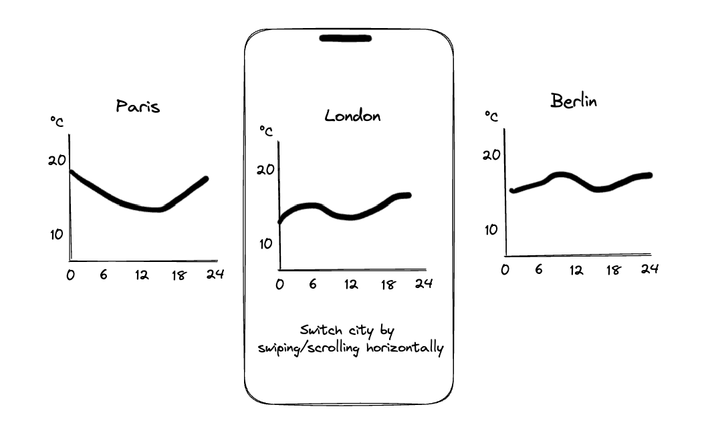

# Mobile Frontend Challenge

## Interview process information

- Below is the task statement. Please read it carefully and reach out if you have any questions!
- The recommended amount of time to spend is **around 4 hours**. Likely not everything can be done perfectly or at all so make sure to prioritize areas that showcase your skills.
- You can spend the time in any way you want (1 burst, 1h/day, ...), no need to track exactly what you spent your time on.
- We would expect you to do the task within 5-7 days - once you are done, please reach out (+send the created code/resources to us). If you need more time (holiday, etc.), let us know and we'll figure it out!

## Task statement

When developing the Veri app, we often need to visualize different data such as glucose data in a meaningful and easily understandable way. When there are a lot of data, it’s not always possible to calculate, fetch, store and render everything at once. One of the interesting question we face is: What is the optimal fetching and rendering strategy? We would like to minimise the loading times for the user and at the same time we would like to avoid fetching a lot of unnecessary information.

This challenge focuses on fetching some data and visualizing it in graphs. You should make a demo app that visualizes temperature data from a free weather API [Open Meteo](https://open-meteo.com/). The app should visualize multiple cities’ hourly temperatures. The user should be able to swipe or scroll horizontally to switch the city. The swiping or scrolling interaction should feel responsive and smooth. 

The app should also have partial offline support. So after inspecting some cities’ data, the user should be able to close the app, turn the internet connection off and open the app and inspect the same cities’ data again.

The app could look something like this, but feel free to take creative liberty:

## Specification

- The app should be developed using React Native. **You can find the boilerplate project on Github at:** [https://github.com/HumanEngineering/mobileChallengeGraph](https://github.com/HumanEngineering/mobileChallengeGraph)
- The app should use [Open Meteo](https://open-meteo.com/) weather API to fetch today's hourly temperature data for each city.
    - See the endpoint: [https://open-meteo.com/en/docs#hourly=temperature_2m](https://open-meteo.com/en/docs#hourly=temperature_2m)
- In the boilerplate project, there is a file called `src/cityCoordinates.json`. It contains all the cities for which you need to fetch and display today's temperature data.
- The user should be able to scroll or swipe horizontally to switch the city. The swiping or scrolling interaction should feel responsive and smooth.

## **Tips and hints**

- Feel free to use any 3rd party libraries. For example, we left the possible chart library choice open on purpose.

## **What we'll be looking for**

- Ability to explain your code.
- Clean and reasonable technical and UX decisions and the ability to argue about them.
- Ability to prioritise and recognise what is valuable - focus on those aspects of this task where you can showcase your skills.

## **When you're done**

- Email your Veri contact a Github project link or a zip file of the project.
- The GitHub project or a zip should contain
    - A brief demo video and/or a set of screenshots showcasing the app's functionality.
    - Make sure to highlight particularly interesting features of your solution!
- If you send us the project as zip, please **don't** include installed `node_modules` folder or any other files listed in `.gitignore`.
